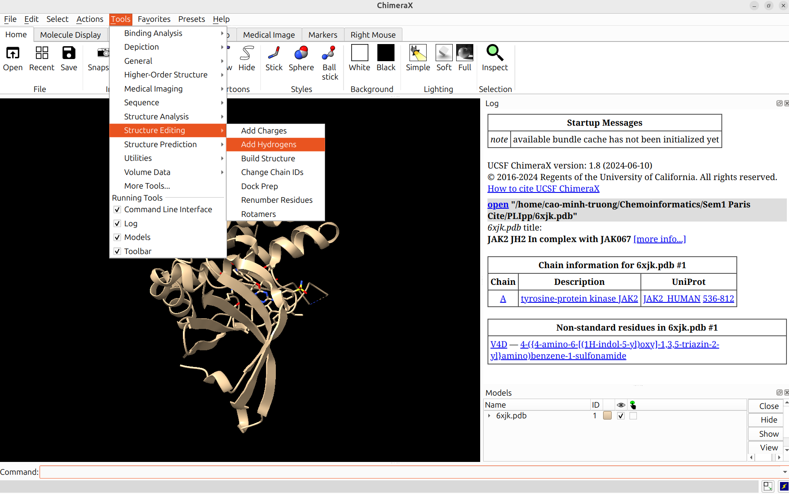
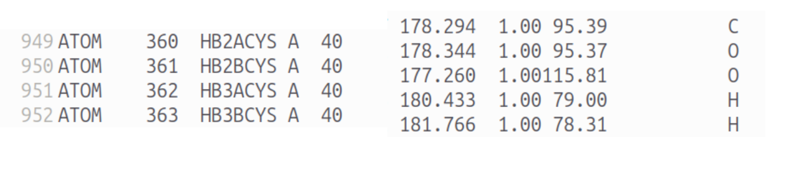

# PLIpp - Protein Ligand Interactions python project

This python project aims to predict the Interaction between protein and ligand based on their coordinates.


## References
Adasme, M. et al. PLIP 2021: expanding the scope of the protein-ligand interaction profiler to DNA and RNA. Nucl. Acids Res. (05 May 2021), gkab294. doi: 10.1093/nar/gkab294

## Requirements

```
pandas==2.2.2
numpy==1.26.4
scipy==1.13.1
```

## Running PLIpp
To generate interactions between a protein and a ligand using the PLIproject, the following steps should be followed:

### Step 1: Assign hydrogen atoms
My suggestion is to use free software ChimeraX with Add Hydrogen option:




### Step 2: Fix errors in pdb file (if any)
To find any errors in pdb file, use:
```
python3 extractfile.py 6xjk.pdb 
```
The most common error with the pdb file is the white space between some columns, for example:



If there are errors, manually fix it before running PLIpp

### Step 3: Find residues in the binding site
To find residues involved in the interactions with the ligand, use:
```
python3 bindingsite.py 6xjk.pdb 
```
The output is in csv file format named: "_protein_activesite.csv"

### Step 4: Find a ligand pharmacophore
To find the ligand pharmacophore, use:
```
python3 pharmacophore.py 6xjk.pdb 
```
The output is in csv file format named:"_pharmacophore.csv"

## Interpretation
Here are some geometric conditions for interactions between protein and ligands:
### π-π interaction
- PLIpp only takes into account of 6-membered aromatic rings
- Aromatic residues: Phe, Tyr, Trp
- π-π sandwich stacking: two rings are parallel and the distance between two centers is less than 5Å
- π-π T-shaped stacking: two normal vectors of two rings are perpendicular and the distance between two centers is less than 5Å
### π-cation interaction
- Positively-charged residues: Lys, Arg, His
- Positively-charged functional groups in the ligand: guanidine, ammonium, sulfonium
- π-cation interaction: angle between vector formed by cation and aromatic centers and aromatic plane is greater than 45° and the distance between cation and aromatic center is less than 5Å
### Hydrophobic interaction
- PLIpp only takes into account of carbon atoms which are not directly linked with any other heteroatoms, such as: nitrogen, oxygen,... 
- The distance between two carbon atoms is from 3.3 to 4.0Å
### Electrostatic interaction
- Positively-charged residues: Lys, Arg, His
- Negatively-charged residues: Glu, Asp
- Positively-charged functional groups in the ligand: guanidine, ammonium, sulfonium
- Negatively-charged functional groups in the ligand: carboxylate, phosphate, sulfate
- The distance between positively-charged and negatively-charged species is less than 5Å
### Hydrogen bond
- The angle of (Donor - Hydrogen - Acceptor) is greater than 130°
- The distance between HBA and HBD is from 2.5 to 3.8Å
### Water bridge
- Similar geometric conditions as hydrogen bond
- PLIpp only considers three cases of water bridge:
    - Protein (donor 1) - Water (acceptor 1 and donor 2) - Ligand (acceptor 2)
    - Protein (donor 1) - Water (acceptor) - Ligand (donor 2)
    - Protein (acceptor 1) - Water (donor 1 and acceptor 2) - ligand (donor 2)
### Halogen bond
- PLIpp only considers Cl, Br, I to make halogen bond
- The angle of (Halogen donor - Halogen - Halogen acceptor) is greater than 168°

